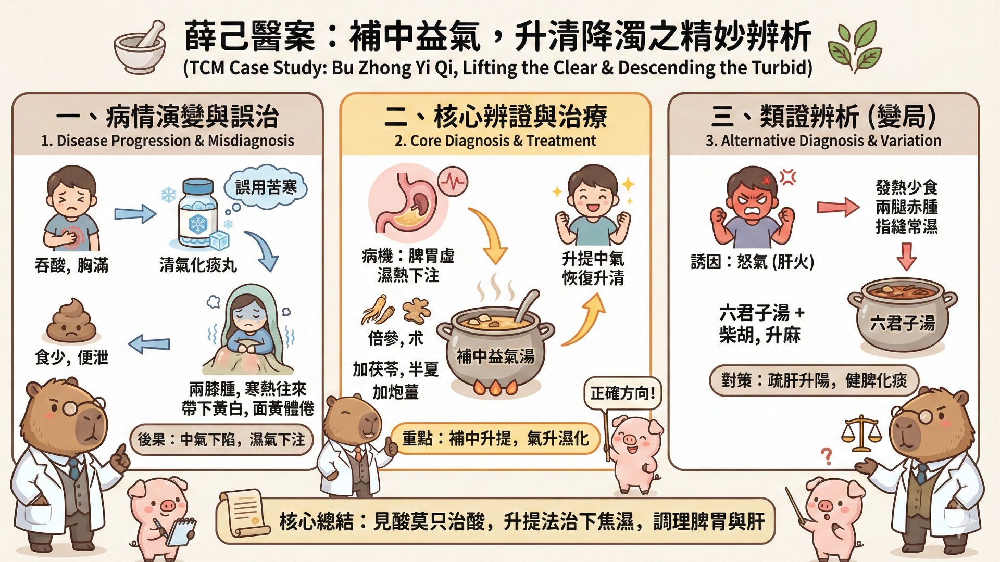
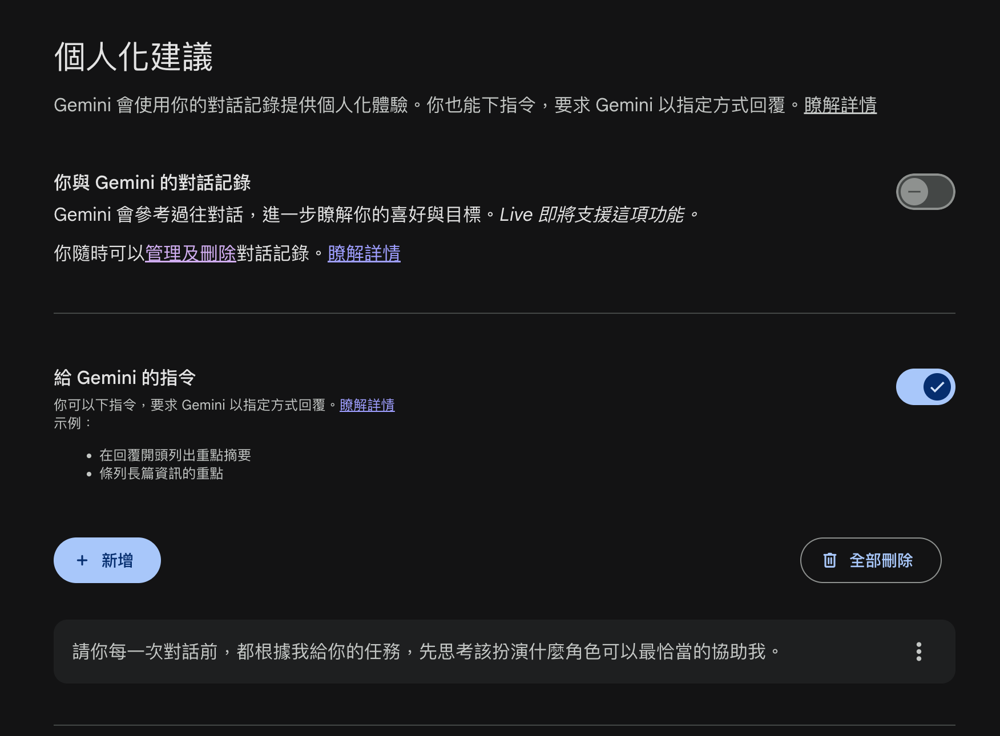

# Module 1 — 古今醫案按的圖解步驟

## 演練案例：脾胃虛濕熱下注型帶下

> 一婦人吞酸胸滿。食少便泄。月經不調。服清氣化痰丸。兩膝漸腫。寒熱往來。帶下黃白。面黃體倦。此脾胃虛濕熱下注。
>
> 用補中益氣倍參、朮。加茯苓、半夏、炮姜而愈。
>
> 若因怒。發熱少食。或兩腿赤腫。或指縫常濕。用六君加柴胡、升麻。及補中益氣。

---

{fig-align="center" width="90%"}

## 操作順序

### 步驟 1：將原文放進 Gemini 進行理解

::: {.callout-tip title="小技巧 1：大括弧限定文件範圍"}
```
{ 文件資料 }
```

用大括弧可以降低 LLM 在前後文的理解辨識錯誤，讓模型知道文件的範圍。
:::

::: {.callout-tip title="小技巧 2：調整 System Prompt"}
```
請你每一次對話前，都根據我給你的任務，
先思考該扮演什麼角色可以最恰當的協助我。
```

**設定範例：**

```
## 角色設定
在回應前，判斷最適合的專業角色（工程師、設計師、
策略顧問、教師、編輯等），並在開頭標注：
**[角色]**：

## 回應原則
- 直接切入重點，不重複使用者說過的話
- 有多種做法時，給出明確建議而非列出所有選項
- 不確定時說不確定，不要編造

## 反思
完成任務後，附上一段簡短反思：
`★ Insight ────────────────────────────────`
[針對這次任務，2-3 個值得注意的觀點或取捨]
`──────────────────────────────────────────`
```
:::

{fig-align="center" width="90%"}

[設定參考來源：臉書貼文連結](https://www.facebook.com/share/p/1CEjgK4PFb/?mibextid=wwXIfr)

### 步驟 2：給予意向性

> **Human intention in, meaningful context out.**

你想要語言模型從什麼樣的層面理解？就必須加入你希望他切入的觀點。

**Prompt 範例：**

```
{ 脾胃虛濕熱下注型帶下

一婦人吞酸胸滿。食少便泄。月經不調。服清氣化痰丸。
兩膝漸腫。寒熱往來。帶下黃白。面黃體倦。此脾胃虛濕熱下注。

用補中益氣倍參、朮。加茯苓、半夏、炮姜而愈。

若因怒。發熱少食。或兩腿赤腫。或指縫常濕。
用六君加柴胡、升麻。及補中益氣。

}

請你以臨床實用診斷觀點，拆解三個重點
```

### 產出範例

針對這段中醫古籍醫案，以「臨床實用診斷」的角度拆解，這不僅僅是一個「白帶（帶下）」的案例，更是一場關於**「虛實辨證」與「升降氣機」**的深度博弈。

#### 重點一：誤治的代價——辨清「真熱」與「中焦虛寒」

醫案開頭提到的「吞酸胸滿、便泄」，初看似乎有痰熱或食積，原醫者用了「清氣化痰丸」。這在臨床上是極大的陷阱。

- **診斷陷阱：** 吞酸不一定是火，也可能是脾胃虛寒導致的「中陽不振」。清氣化痰丸藥性苦寒，對於「食少便泄」的脾虛患者來說，無異於雪上加霜。
- **臨床反饋：** 服藥後「兩膝漸腫、寒熱往來」，代表苦寒藥傷了脾陽，導致濕邪不化，反而下注關節。
- **關鍵點：** **臨床見到熱象（黃帶、吞酸），必須先確認脾胃的「運化能力」。** 若有便泄、體倦，應「守中」而非「攻邪」。

#### 重點二：核心機制——「升清則下流自止」

| 藥物 | 用意 |
|------|------|
| 倍參、朮 | 極力恢復中焦的「泵」功能，把氣提起來 |
| 炮薑 | 溫性化散下焦的寒濕，守住中陽，防止參、朮過於滋膩 |
| 茯苓、半夏 | 化濕和胃降逆 |

**關鍵點：** **治療下焦濕熱，不一定要用利尿苦寒藥；透過「升提中氣」讓水液各歸其位，才是治本。**

#### 重點三：變證診斷——情緒與經絡的「延伸連鎖」

| 觸發因素 | 臨床表現 | 診斷思路 | 建議方案 |
|----------|----------|----------|----------|
| 情志（怒） | 發熱、兩腿赤腫 | 肝木克脾土，肝經濕熱下滲 | 補中益氣 + 舒肝（柴胡、升麻） |
| 濕氣偏盛 | 指縫常濕 | 脾主四肢，濕邪透過經絡末梢外溢 | 加強燥濕健脾（六君子湯） |

### 步驟 3：進行 Infographic 化

```
{ 內容 }

請你將這段內容進行 infographic 圖解，專業可愛風格，
以水豚君教授小白豬助理為輔助
```

::: {.callout-note title="Prompt 說明"}
- **風格**會決定整張圖解的整體樣式，如果要讓整個風格統一，必須在指令時就要建立
- 如果要**固定某些角色**在圖解內，就要加入 Prompt
- 圖片是預覽，要完整的圖片解析度，**要下載**
:::

**練習步驟：**

1. 先以剛剛的對話窗，直接輸入
2. 開新的對話窗，重新輸入內容，比較差異

### 範例展示

{fig-align="center" width="90%"}
