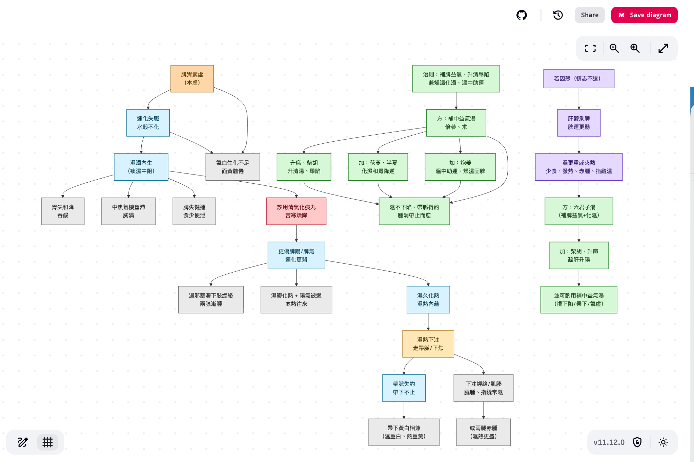

# Module 2 — 病因病機的邏輯實現

## 演練：將古今醫案按病因病機化

> 脾胃虛濕熱下注型帶下
>
> 一婦人吞酸胸滿。食少便泄。月經不調。服清氣化痰丸。兩膝漸腫。寒熱往來。帶下黃白。面黃體倦。此脾胃虛濕熱下注。
>
> 用補中益氣倍參、朮。加茯苓、半夏、炮姜而愈。
>
> 若因怒。發熱少食。或兩腿赤腫。或指縫常濕。用六君加柴胡、升麻。及補中益氣。

**成果目標：**

{fig-align="center" width="90%"}

## 操作順序

### 步驟 1：Prompt 練習 1 — 病因病機拆解

```
請以病因病機的角度來拆解此案

{脾胃虛濕熱下注型帶下

一婦人吞酸胸滿。食少便泄。月經不調。服清氣化痰丸。
兩膝漸腫。寒熱往來。帶下黃白。面黃體倦。此脾胃虛濕熱下注。

用補中益氣倍參、朮。加茯苓、半夏、炮姜而愈。

若因怒。發熱少食。或兩腿赤腫。或指縫常濕。用六君加柴胡、升麻。及補中益氣。

}
```

### 步驟 2：Prompt 練習 2 — 以彩色 Mermaid 語法輸出

```
請以彩色 mermaid 語法輸出
```

### 成果範例

```{mermaid}
flowchart TD

%% ========== Nodes ==========
A[脾胃素虛<br/>（本虛）] --> B[運化失職<br/>水穀不化]
B --> C[濕濁內生<br/>（痰濕中阻）]
C --> D1[胃失和降<br/>吞酸]
C --> D2[中焦氣機壅滯<br/>胸滿]
C --> D3[脾失健運<br/>食少便泄]
B --> D4[氣血生化不足<br/>面黃體倦]
A --> D4
C --> E[誤用清氣化痰丸<br/>苦寒燥降]
E --> F[更傷脾陽/脾氣<br/>運化更弱]
F --> G[濕邪壅滯下肢經絡<br/>兩膝漸腫]
F --> H[濕鬱化熱 + 陽氣被遏<br/>寒熱往來]
F --> I[濕久化熱<br/>濕熱內蘊]
I --> J[濕熱下注<br/>走帶脈/下焦]
J --> K[帶脈失約<br/>帶下不止]
K --> L[帶下黃白相兼<br/>（濕重白、熱重黃）]
J --> M[下注經絡/肌腠<br/>腿腫、指縫常濕]
M --> N[或兩腿赤腫<br/>（濕熱更盛）]

%% ========== Treatment ==========
T[治則：補脾益氣、升清舉陷<br/>兼燥濕化濁、溫中助運] --> P[方：補中益氣湯<br/>倍參、朮]
P --> Q[加：茯苓、半夏<br/>化濕和胃降逆]
P --> R[加：炮姜<br/>溫中助運、燥濕固脾]
P --> S[升麻、柴胡<br/>升清陽、舉陷]
S --> U[濕不下陷、帶脈得約<br/>腫消帶止而愈]
Q --> U
R --> U
P --> U

%% ========== Emotional factor branch ==========
X[若因怒（情志不遂）] --> Y[肝鬱乘脾<br/>脾運更弱]
Y --> Z[濕更重或夾熱<br/>少食、發熱、赤腫、指縫濕]
Z --> AA[方：六君子湯<br/>（補脾益氣+化濕）]
AA --> AB[加：柴胡、升麻<br/>疏肝升陽]
AB --> AC[並可酌用補中益氣湯<br/>（視下陷/帶下/氣虛）]
```

### 步驟 3：複製語法，貼入渲染平台

- 線上渲染：[mermaid.live](https://mermaid.live/)
- **推薦 Notion**，裡面自己就有渲染 Mermaid 語法的功能

  啟用方式：打 `/` 找 `mermaid`

### 步驟 4：成果目標

{fig-align="center" width="90%"}

### 步驟 5：混合 Module 1 的技巧

```
請以 infographic 的生圖，以專業可愛風格，水豚君教授小白豬助理為輔助
{ mermaid 語法貼入 }
```

**成果：**

{fig-align="center" width="90%"}

## 什麼是 Mermaid？

Mermaid 是一種基於 **Markdown 啟發式語法**的工具，主要用於將文字程式碼快速轉換成各種圖表和流程圖。

**簡介：**

Mermaid 是一種 JavaScript 架構的圖表繪製工具，它允許您使用簡單、可讀性高的文字代碼來定義圖表結構，然後將這些代碼「渲染」成視覺化的圖形。

**在文件中的應用：**

在 Module 2 中，Mermaid 語法作為「結構化病機思考」的輸出工具：

- **目的：** 將古今醫案中複雜的病因、病機、誤治與治療分支等邏輯關係視覺化
- **方式：** 透過撰寫文字程式碼（例如 `flowchart TD` 後定義節點和箭頭）
- **結果：** 輸出為清晰的**邏輯流程圖**，以視覺化的方式呈現病理演變
- **操作平台：** [mermaid.live](https://mermaid.live/) 或 Notion
