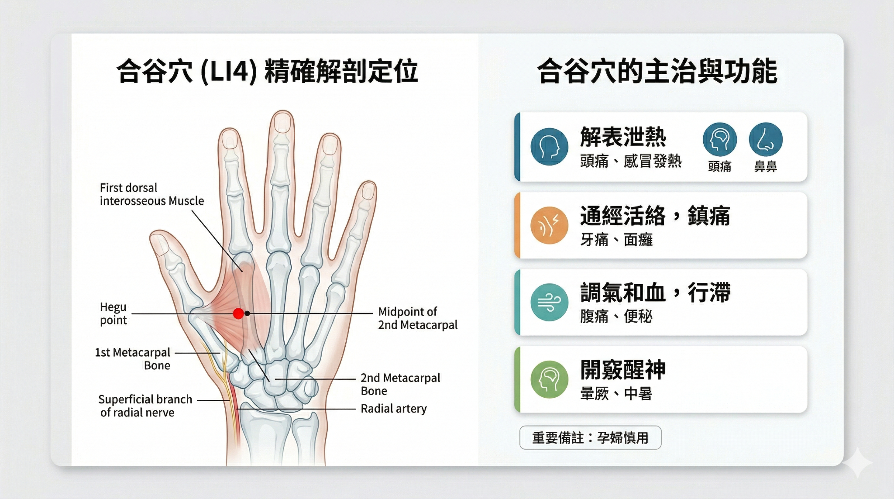
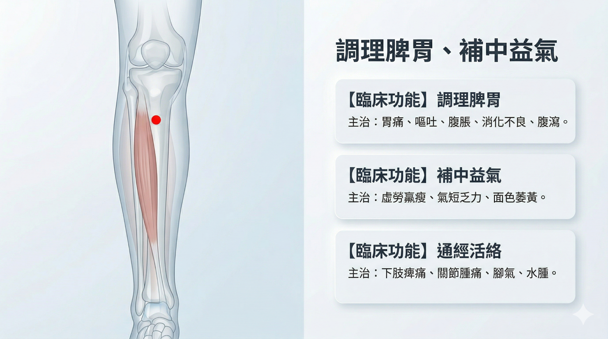

# Module 4 — 製作醫學解剖插畫圖片

{fig-align="center" width="90%"}

## 學習重點：什麼是 META-Prompt

META-Prompt 是一種更複雜、更詳細的指令，它事先為 AI 設定了**角色（Role）**、**目標（Goal）**、**固定風格參數（Design Guidelines）**，以及**內容邏輯結構（Quadrant Logic）**。

核心目的：

- **穩定風格**：確保每次生成圖像時，都能維持一致的藝術風格、色彩調性、排版與質感。
- **結構化內容**：將複雜主題拆解成固定的邏輯區塊，強迫 AI 按照這個結構輸出細節。
- **自動化複雜提示詞的生成**：一旦設定好 META-Prompt，使用者只需輸入一個簡單的主題，AI 就能自動根據所有預設規則，產生出完整且極度精確的英文圖像生成提示詞。

## 步驟 1：輸入 META-Prompt

```
你現在是一位結合中醫解剖學與醫療視覺設計的專家。

接下來，當我輸入任何【穴位名稱】時，請精確分析其解剖結構與主治功能，
並「嚴格」依照以下的 YAML 格式輸出結果。不要夾帶任何其他廢話。
```

**YAML 輸出格式定義：**

```yaml
acupuncture_point:
  name: "[穴位繁體中文名稱] ([國際代碼，例如 LI4])"
  pinyin: "[拼音]"
  anatomy_details:
    bone_landmark: "[精確的骨骼基準與定位點]"
    muscle_layer: "[主要肌肉層次與深度]"
    nerve_vessel: "[關鍵神經與血管]"
  clinical_functions:
    - function: "[核心主治一]"
      symptoms: "[對應症狀，限 5 個字內]"
    - function: "[核心主治二]"
      symptoms: "[對應症狀，限 5 個字內]"
    - function: "[核心主治三]"
      symptoms: "[對應症狀，限 5 個字內]"
  visual_generation_parameters:
    layout: "16:9 寬版雙欄設計，左側半透明解剖圖，右側功能資訊卡片"
    text_elements_zh_tw_for_post_editing:
      title: "[穴位名稱] 精確解剖定位與主治"
      anatomy_labels: ["[骨骼繁體標籤]", "[肌肉繁體標籤]", "[神經血管繁體標籤]"]
    image_generation_prompt: >
      A highly professional 16:9 medical infographic poster. Split layout.
      Left side: Precise semi-transparent medical illustration of the [身體部位英文],
      revealing the [具體骨骼英文] and [具體肌肉英文]. A clear red dot marks the
      [拼音] acupuncture point. Attempt to include Traditional Chinese typography
      for labels: "[代入骨骼與肌肉的繁體中文]".
      Right side: Clean, modern clinical UI layout with 3 minimalist medical
      function cards. Soft clinical colors (light blue, gray, white), scientific
      aesthetics, no cluttered background. Attempt to write Traditional Chinese
      text: "[代入核心主治一]、[代入核心主治二]".
```

## 步驟 2：輸入你要的穴位

範例輸入：`足三里`

### 輸出範例

```yaml
acupuncture_point:
  name: "足三里 (ST36)"
  pinyin: "Zú Sān Lǐ"
  anatomy_details:
    bone_landmark: "脛骨前嵴外側一橫指，犢鼻下 3 寸"
    muscle_layer: "脛骨前肌、趾長伸肌深部"
    nerve_vessel: "腓深神經、脛前動靜脈"
  clinical_functions:
    - function: "調理脾胃"
      symptoms: "胃痛、嘔吐"
    - function: "補中益氣"
      symptoms: "疲勞、虛弱"
    - function: "通經活絡"
      symptoms: "下肢痹痛"
  visual_generation_parameters:
    layout: "16:9 寬版雙欄設計，左側半透明解剖圖，右側功能資訊卡片"
    text_elements_zh_tw_for_post_editing:
      title: "足三里 精確解剖定位與主治"
      anatomy_labels: ["脛骨前嵴", "脛骨前肌", "腓深神經"]
    image_generation_prompt: >
      A highly professional 16:9 medical infographic poster. Split layout.
      Left side: Precise semi-transparent medical illustration of the lower leg,
      revealing the Tibia and Tibialis anterior muscle. A clear red dot marks the
      Zusanli acupuncture point. Attempt to include Traditional Chinese typography
      for labels: "脛骨、脛骨前肌".
      Right side: Clean, modern clinical UI layout with 3 minimalist medical
      function cards. Soft clinical colors (light blue, gray, white), scientific
      aesthetics, no cluttered background. Attempt to write Traditional Chinese
      text: "調理脾胃、補中益氣".
```

## 步驟 3：將 Prompt 貼入新的對話窗

勾選：生成圖片，模型：思考型

注意範例圖片為穴位標示有誤版本，出圖仍要檢查。

{fig-align="center" width="90%"}

## 步驟 4：如何生成 META-Prompt

當你跟生成式 AI 互動，覺得結果最滿意的時候，請後續輸入：

```
請輸出這個結果的 META-Prompt
```

::: {.callout-note}
參考對話紀錄：[穴位解剖定位與衛教圖生成對話紀錄](https://docs.google.com/document/d/1n45IRTAmY5MYzIvps4uOkZ1VzuDJxR5SuAbou31Adc8/edit?usp=sharing)
:::

## META-Prompt 總結

| 要素 | 說明 |
|------|------|
| **Role（角色）** | 專業醫學解剖插畫家 |
| **Goal（目標）** | 根據主題撰寫詳細的圖像生成提示詞 |
| **Design Guidelines（設計指南）** | 固定 2x2 排版、復古米色工程方格紙背景、達文西解剖風格 |
| **Quadrant Logic（四格邏輯）** | 骨骼/關節 → 肌肉/軟組織 → 神經/循環/臟器 → 整體體態/剪影 |

META-Prompt 是將您的**專業醫療知識**和**視覺化意圖**，轉化為**可重複、可控制、高準確性**的 AI 提示詞的**高階結構化框架**。
